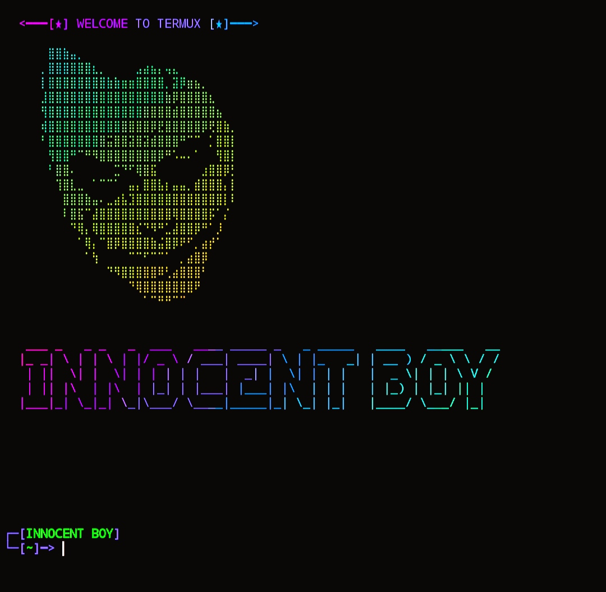

## COMMAND :

* `pkg update && pkg upgrade`

* `pkg install python`

* `pkg install git`

* `rm -rf T-BANNER`

* `git clone https://github.com/MUMIT-404-CYBER/T-BANNER.git`

* `cd T-BANNER`

* `python run.py`

___This Tool is Free Enjoy Dear User.___ 

## SCREENSHOT :
 

